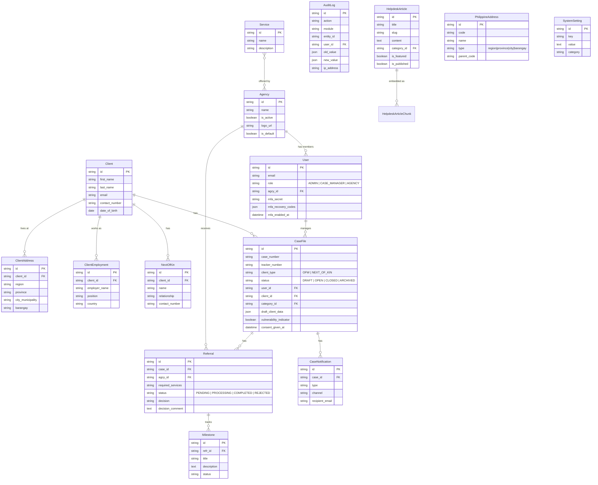
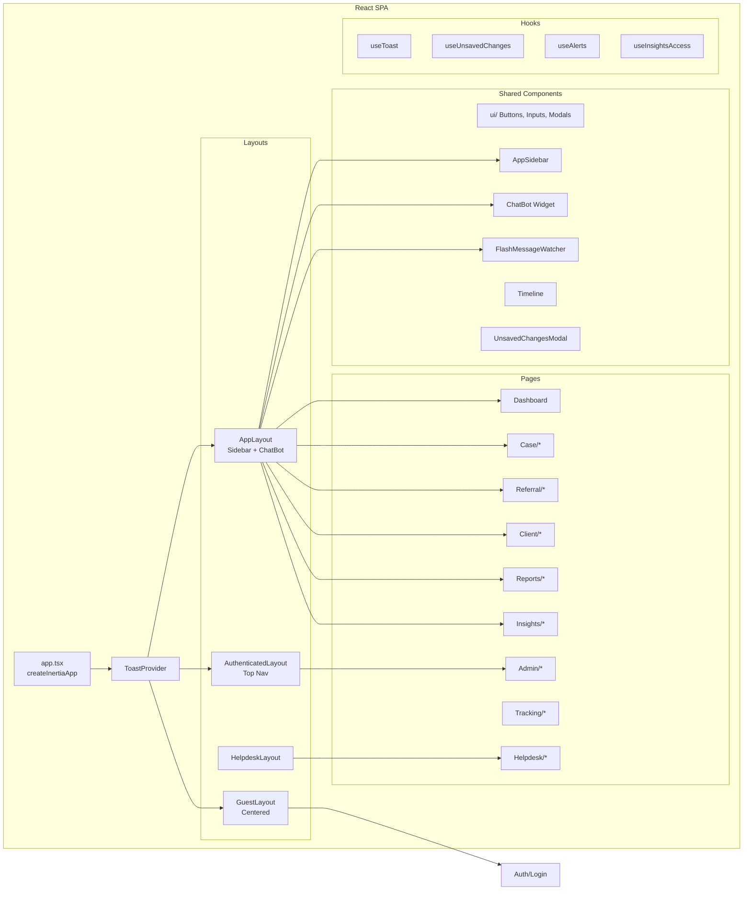

# Architecture Overview — One Window Bayanihan

> **DMW Region VII Case Management System** — A Laravel 13 + Inertia SPA for managing OFW cases, inter-agency referrals, and compliance tracking.

---

## Stack

| Layer       | Technology                                    |
|-------------|-----------------------------------------------|
| Backend     | Laravel 13 (PHP 8.3+)                         |
| Frontend    | React 18 + Inertia.js SPA + Tailwind CSS 3    |
| Database    | PostgreSQL (Supabase managed)                 |
| Cache       | Database-driven (`CACHE_STORE=database`)      |
| Queue       | Database-driven (`QUEUE_CONNECTION=database`) |
| Realtime    | Pusher / laravel-websockets                   |
| Storage     | Supabase Storage (S3-compatible)              |
| Build       | Vite 8, npm                                   |

### Key Dependencies

- **CheckRole middleware** — RBAC via `users.role` column (roles: `ADMIN`, `CASE_MANAGER`, `AGENCY`)
- **laravel-vite-plugin** + **@inertiajs/react** — SPA routing
- **pgvector** — Vector embeddings for AI helpdesk search
- **Laravel Notifications** — Database-backed in-app + mail notifications

---

## High-Level Architecture

```mermaid
graph TB
    subgraph "Client Layer"
        Browser["Browser<br/>(React SPA)"]
        Public["Public Visitors<br/>(Tracking / Helpdesk)"]
    end

    subgraph "Laravel Backend"
        direction TB
        Routes["Routes<br/>(web.php / auth.php / api.php)"]
        
        subgraph "Middleware Stack"
            MW["Auth<br/>Verified<br/>Role<br/>IP Whitelist<br/>Throttle"]
        end

        subgraph "Controllers"
            AuthCtrl["Auth / OTP<br/>LoginOtpController"]
            CaseCtrl["CaseController"]
            RefCtrl["ReferralController"]
            DashboardCtrl["Dashboard (Closure)"]
            TrackCtrl["TrackController"]
            ChatbotCtrl["ChatbotController"]
            AdminCtrl["Admin Controllers<br/>(17 modules)"]
            InsightsCtrl["InsightsApiController"]
            ReportsCtrl["ReportsController"]
        end

        subgraph "Service Layer"
            OtpSvc["OtpService"]
            CaseSvc["CaseService"]
            RefSvc["ReferralService"]
            DashboardSvc["DashboardService"]
            ReportsSvc["ReportsService"]
            TrackingSvc["TrackingService"]
            NotifSvc["NotificationService"]
            AuditFmt["AuditLogFormatter"]
            ChatbotCaseSvc["ChatbotCaseService"]
            AiSvc["AiService"]
            PromptSvc["PromptAssemblyService"]
            RetrievalSvc["RetrievalRankingService"]
            HelpCenterSvc["HelpCenter Providers"]
            InsightsSvc["InsightsService"]
            StorageSvc["StorageService"]
            SecuritySvc["SecuritySettingsService"]
            HealthSvc["SystemHealthService"]
        end

        subgraph "Models / Data"
            UserM["User"]
            ClientM["Client"]
            CaseM["CaseFile (cases)"]
            ReferralM["Referral"]
            AgencyM["Agency"]
            ServiceM["Service"]
            MilestoneM["Milestone"]
            AuditLogM["AuditLog"]
            NotificationM["Notification"]
            HelpdeskM["HelpdeskArticle<br/>Category / Tag"]
            FeedbackM["Feedback<br/>ServqualConfig"]
            SettingM["SystemSetting"]
            AddressM["PhilippineAddress"]
        end

        subgraph "Background / Async"
            Jobs["Jobs<br/>EmbedHelpdeskArticleChunks<br/>SyncPhilippineAddresses"]
            Notifications["Mail Notifications<br/>CaseUpdated / ReferralCreated<br/>MilestoneAdded / etc."]
            Observers["AuditObserver"]
        end
    end

    subgraph "External"
        MailSvc["Mail (log / SMTP)"]
        SupabaseStorage["Supabase Storage"]
        Pusher["Pusher / WebSockets"]
    end

    Browser --> Routes
    Public --> Routes
    Routes --> MW
    MW --> AuthCtrl & CaseCtrl & RefCtrl & DashboardCtrl & TrackCtrl & ChatbotCtrl & AdminCtrl & InsightsCtrl & ReportsCtrl
    AuthCtrl --> OtpSvc
    AuthCtrl -.-> MailSvc
    CaseCtrl --> CaseSvc
    CaseCtrl --> AuditFmt
    CaseSvc --> NotifSvc
    CaseSvc --> CaseM & ClientM & ReferralM
    RefCtrl --> RefSvc
    RefSvc --> NotifSvc
    RefSvc --> ReferralM & AgencyM
    DashboardCtrl --> DashboardSvc & ReportsSvc
    DashboardSvc --> CaseM & ReferralM & AgencyM & UserM
    TrackCtrl --> TrackingSvc & OtpSvc
    TrackingSvc --> CaseM & AuditFmt
    ChatbotCtrl --> ChatbotCaseSvc & AiSvc
    ChatbotCtrl --> OtpSvc
    ChatbotCaseSvc --> CaseSvc & OtpSvc
    AiSvc --> PromptSvc & RetrievalSvc & HelpCenterM
    ReportsSvc --> CaseM & ReferralM
    InsightsCtrl --> InsightsSvc
    InsightsSvc --> CaseM & ReferralM & FeedbackM & AuditLogM
    NotifSvc -.-> MailSvc
    Observers --> AuditLogM
    Jobs --> HelpdeskM & AddressM
    Notifications --> NotifSvc
```



---

## Functional Areas

### 1. Authentication & Security (Auth Flow)

**Custom OTP 2FA** — not the default Laravel Breeze scaffolding.

1. User submits email + password → `LoginOtpController::init()`
2. `OtpService::generate()` creates 6-digit OTP, stores in DB cache (5-min TTL), emails it
3. User submits OTP → `LoginOtpController::verifyOtp()` → `OtpService::verify()` → Auth logged in
4. **MFA**: `MfaController` provides TOTP-based multi-factor via recovery codes
5. **Session management**: `ActiveSessionsController` for admin session oversight

**Middleware chain**: `auth` → `verified` → `role:ADMIN/CASE_MANAGER/AGENCY` → `ip.whitelist`

### 2. Case Management (Core Domain)

Cases represent OFW assistance requests handled by case managers.

- **Status lifecycle**: `DRAFT → OPEN → CLOSED / ARCHIVED`
- **Case types**: `OFW` (direct) or `NEXT_OF_KIN` (family-initiated)
- **Route group**: `/cases/*` — CRUD, drafts, publish, archive, toggle-status
- **Controller**: `CaseController` delegates to `CaseService` for business logic
- **Key flows**:
  - **Create**: `store()` → `CaseService::createCase()` in DB transaction → creates client/address/employment/next-of-kin → audit log → notification
  - **Update**: `update()` → `CaseService::updateCase()` → `NotificationService::dispatchCaseUpdateNotification()` → `notifyUsers()`
  - **Toggle status**: `toggleStatus()` → `CaseService::toggleStatus()` → `CaseStatusUpdated` notification
  - **Draft**: `store(isDraft:true)` → saves with `DRAFT` status + `draft_client_data` JSON → later `publish()` transitions to `OPEN`

### 3. Referral System (Inter-Agency)

Referrals connect cases to agency services for specialized assistance.

- **Status lifecycle**: `PENDING → PROCESSING → COMPLETED / REJECTED`
- **Route group**: `/referrals/*` — CRUD, status updates, milestones, comments, attachments
- **Controller**: `ReferralController` delegates to `ReferralService`
- **Key flows**:
  - **Create**: `store()` → creates referral → audit log → notifies agency users (`ReferralCreated`) → notifies OFW client via email
  - **UpdateStatus**: `updateStatus()` → updates status, decision, comment → `ReferralStatusChanged` notification → `notifyOfw()`
  - **AddMilestone**: `addMilestone()` → creates milestone on referral → `MilestoneAdded` notification → `notifyOfw()`
  - **Versioned attachments**: Attachments support version history via `version_group_id`

### 4. Public Case Tracking

Clients (OFWs) can track their case status publicly without logging in.

- **Flow**: `/track` → enter email → `sendOtp()` → enter OTP → `verifyOtp()` → view case data
- **Controller**: `TrackController` uses `TrackingService` + `OtpService`
- **Security**: Throttled (`throttle:tracking`), OTP-verified access

### 5. Dashboard & Analytics

Role-based dashboards showing aggregated case and referral data.

- **Route**: `/dashboard` — closure-based, instantiates `DashboardService` + `ReportsService`
- **Role variants**: `AGENCY` sees agency-specific data, `ADMIN` sees all, `CASE_MANAGER` sees system-wide stats
- **Reports**: `/reports` — aggregated reports + PDF export + AI-powered insight generation

### 6. Helpdesk & Knowledge Base

Public knowledge base with AI-powered chatbot.

- **Public**: `/helpdesk` — searchable articles categorized and tagged
- **Admin**: `/admin/helpdesk/articles/*` — full CRUD, featured articles, version history (revisions), image upload
- **AI Search**: pgvector-powered semantic search via `EmbeddingService` → `HelpdeskArticleChunks`
- **Feedback**: Per-article helpfulness rating

### 7. AI Chatbot

Context-aware chatbot embedded in the sidebar of all authenticated pages.

- **Widget**: Self-contained React widget at `resources/js/chatbot-widget/`
- **Controller**: `ChatbotController::message()` — accepts messages, returns AI responses
- **Tool-based architecture**:
  - `handleSearchCases` → search case data
  - `handleGetCaseDetail` → get specific case details  
  - `handleInitiateCaseOTP` → send OTP for case access
  - `handleVerifyCaseOTP` → verify OTP for case access
- **LLM Providers**: Anthropic, OpenAI, Google Gemini (pluggable via `AiProvider` contract)
- **Ranking**: `RetrievalRankingService` scores and filters retrieval results
- **Observability**: `RetrievalLogger` + `UnansweredTracker` for monitoring

### 8. Audit & Observability

Full audit trail for all entity changes.

- **Observer**: `AuditObserver` hooks into Eloquent events → writes to `audit_logs` table
- **Audit Log viewer**: `/audit-logs` with filters by entity, action, user
- **Formatter**: `AuditLogFormatter` resolves user names, formats field changes
- **System Health**: `/admin/system/health` — checks queue, cache, database, disk
- **Alerts**: Configurable alert thresholds, test email, email logs

### 9. Admin Panel

Role-gated (`ADMIN` + `ip.whitelist`) management interfaces:

| Module | Controller | Description |
|--------|-----------|-------------|
| Agencies | `AdminAgencyController` | CRUD, activation |
| Services | `AdminServiceController` | CRUD across agencies |
| Users | `AdminUserController` | User management |
| System Settings | `SystemSettingsController` | Key-value config (inc. debug OTP toggle) |
| Case Categories | `AdminCaseCategoryController` | Case type categorization |
| Case Statuses | `AdminCaseStatusController` | Status workflow labels |
| Helpdesk | `HelpdeskArticleController` + Category + Tag | Knowledge base management |
| System | Health, Storage, Backups, Logs, Scheduled Tasks, Maintenance, Security, Active Sessions, Alerts, Email Logs, Addresses | Comprehensive system administration |

### 10. Notifications

Dual-channel notification system:

- **In-app**: Database-backed notifications via `notifications` table, fetched via `/notifications` API
- **Email**: Laravel Mail + Queue for OFW case updates
- **Notification classes**: `CaseUpdated`, `CaseStatusUpdated`, `ReferralCreated`, `ReferralStatusChanged`, `MilestoneAdded`, `SystemAlertNotification`
- **OFW notifications**: `NotificationService::notifyOfw()` sends email to case clients

---

## Data Model (Core Entities)



---

## Key Execution Flows

### 1. OTP Login Flow

```
User                  Controller              OtpService        Cache        Mail
 |                        |                       |               |           |
 |— POST /login (email/pw)|                       |               |           |
 |                        |— validate creds       |               |           |
 |                        |— OtpService::generate()               |           |
 |                        |   |— random_int(6-digit)              |           |
 |                        |   |— Cache::put("otp:login:email") ──>|           |
 |                        |   |— Mail::to(email)->queue(OtpMail) ──────────>|
 |                        |— return Inertia Login (step=otp)      |           |
 |                        |                       |               |           |
 |— POST /login/verify-otp|                       |               |           |
 |                        |— OtpService::verify() |               |           |
 |                        |   |— Cache::get() ───────────────────>|           |
 |                        |   |— Cache::forget()                  |           |
 |                        |— Auth::login()        |               |           |
 |                        |— session->regenerate()|               |           |
 |                        |— redirect /dashboard  |               |           |
```

### 2. Case Creation Flow

```
User                  CaseController         CaseService              DB
 |                        |                       |                    |
 |— POST /cases           |                       |                    |
 |                        |— validates request    |                    |
 |                        |— CaseService::createCase()                |
 |                        |   |— DB::transaction() ──────────────>    |
 |                        |   |   |— CaseFile::create()          >    |
 |                        |   |   |— Client::create/find()       >    |
 |                        |   |   |— ClientAddress::create()     >    |
 |                        |   |   |— ClientEmployment::create()  >    |
 |                        |   |   |— NextOfKin::create()         >    |
 |                        |   |   |— AuditLog::create(CREATE)    >    |
 |                        |   |— notifSvc->notifyAssignedUser()  |    |
 |                        |   |— return case->load(relations)    |    |
 |                        |— Inertia::render(Case/Show)          |    |
```

### 3. Referral with Agency Notification Flow

```
CaseManager            ReferralController      ReferralService          Agency Users          OFW Client
 |                          |                       |                       |                    |
 |— POST /referrals         |                       |                       |                    |
 |                          |— validates            |                       |                    |
 |                          |— ReferralService::createReferral()            |                    |
 |                          |   |— DB::transaction()|                       |                    |
 |                          |   |   |— Referral::create()                   |                    |
 |                          |   |   |— AuditLog::create()                   |                    |
 |                          |   |— User::where(agcy_id)                     |                    |
 |                          |   |— Notification::send(ReferralCreated) ────>|                    |
 |                          |   |— notifSvc->notifyOfw(                     |                    |
 |                          |   |     referral_created) ──────────────────────────────────────>|
 |                          |   |— return referral->load()                  |                    |
 |                          |— redirect referrals.show                      |                    |
```

### 4. AI Chatbot Tool Query Flow

```
User              ChatbotController      AiService           PromptAssembly      RetrievalRanking     HelpdeskChunks
 |                     |                     |                      |                   |                   |
 |— POST /chatbot      |                     |                      |                   |                   |
 |                     |— parse + validate   |                      |                   |                   |
 |                     |— route to handler   |                      |                   |                   |
 |                     |— handleSearchCases  |                      |                   |                   |
 |                     |   |— AiService::query()                   |                   |                   |
 |                     |      |— buildSystemPrompt() ──────────────>|                   |                   |
 |                     |      |— retrieval::rank(query) ──────────────────────────────>|                   |
 |                     |      |   |— calculateScore()              |                   |                   |
 |                     |      |   |— getMinimumScoreThreshold()    |                   |                   |
 |                     |      |   |— cosineSimilarity(embedding) ────────────────────────────>|           |
 |                     |      |— LLM provider (Anthropic/OpenAI)   |                   |                   |
 |                     |      |— format + return response          |                   |                   |
 |                     |— return JSON to widget                    |                   |                   |
```

---

## Frontend Architecture



- **Layout selection**: Controllers pass no specific layout — Inertia resolves via page component location
- **Flash messages**: `HandleInertiaRequests.php` shares `flash` prop → `FlashMessageWatcher` in all layouts → auto-toast via `ToastProvider`
- **Unsaved changes**: All form pages use `useUnsavedChanges(dirty)` hook + `UnsavedChangesModal`
- **Chatbot widget**: Loaded on every authenticated page via `AppLayout`

---

## Directory Structure

```
app/
├── Console/              # Artisan commands
├── Contracts/            # Domain contracts/interfaces
├── Http/
│   ├── Controllers/      # Request handlers
│   │   ├── Admin/        # 17 admin management controllers
│   │   ├── Api/          # API controllers (address, clients)
│   │   └── Auth/         # 9 auth controllers (Breeze scaffold)
│   └── Middleware/       # CheckRole, IpWhitelist, HandleInertiaRequests, SetPostgresSession
├── Jobs/                 # EmbedHelpdeskArticleChunks, SyncPhilippineAddresses
├── Listeners/
├── Mail/                 # OtpMail
├── Models/               # 33 Eloquent models (all UUID, soft-delete flagged)
│   └── Concerns/         # UsesUuid trait, SoftDeleteFlag trait
├── Notifications/        # 5 notification classes
├── Observers/            # AuditObserver (generic Eloquent auditing)
├── Providers/
└── Services/             # 29 service classes
    ├── Ai/               # LLM abstraction (Anthropic, OpenAI, Gemini)
    ├── Chatbot/          # Chatbot case/data services
    ├── Content/          # Content management
    ├── HelpCenter/       # Knowledge base provider + ranking
    └── Observability/    # Retrieval logging, unanswered tracking

config/                   # Laravel config files
database/
├── factories/
├── migrations/           # 66 migration files
└── seeders/

resources/js/
├── Components/           # 38 React shared components
│   ├── Admin/            # Admin-specific components
│   ├── Helpdesk/         # Helpdesk components
│   ├── Reports/          # Reports components
│   ├── ui/               # Base UI primitives
│   └── landing/          # Landing page components
├── Hooks/                # 4 custom React hooks
├── Layouts/              # 4 layout templates
├── Pages/                # 23 page directories
│   ├── Admin/            # Agency, Service, User, Settings, etc.
│   ├── Auth/             # Login, Register, Password, Verify
│   ├── Case/             # Index, Show, Create, Edit
│   ├── Referral/         # Index, Show, Create
│   └── ...               # Analytics, Feedback, Helpdesk, etc.
├── chatbot-widget/       # Standalone chatbot widget
├── lib/                  # Library utilities
└── types/                # TypeScript definitions

routes/
├── web.php               # 295 lines — all authenticated + public pages
├── auth.php              # 74 lines — all auth routes (login/register/password)
└── api.php               # Address lookup API (PSGC)
```

---

## Architectural Patterns

### Service Layer
Controllers are thin — they validate input and delegate all business logic to Service classes. Services encapsulate:
- DB transactions for multi-step operations
- Audit log creation
- Notification dispatching
- Authorization checks

### UUID Primary Keys
All models use UUID primary keys via the `UsesUuid` trait. Route model binding works implicitly with string IDs.

### Flag-Based Soft Deletes
Instead of Laravel's built-in soft deletes, the codebase uses `is_deleted`, `deleted_at`, and `deleted_by` columns via the `SoftDeleteFlag` trait.

### Audit Trail
The `AuditObserver` hooks into Eloquent `created`, `updated`, and `deleted` events on auditable models and writes change records to the `audit_logs` table. The `AuditLogFormatter` serializes changes with human-readable field names.

### Form Request Validation
Inline validation in controllers (basic cases) or dedicated Form Request classes for complex validation logic.

### Role-Based Access
Three roles (`ADMIN`, `CASE_MANAGER`, `AGENCY`) gated via:
- `CheckRole` middleware (`role:ADMIN`, `role:AGENCY`, `role:ADMIN,CASE_MANAGER`)
- `ip.whitelist` middleware for admin routes
- Throttle middleware for OTP and login endpoints

### Inertia SPA
No Blade templates (except the root layout). All rendering is React JSX, served through Inertia's server-side prop sharing. Page components auto-resolve from `resources/js/Pages/`.
