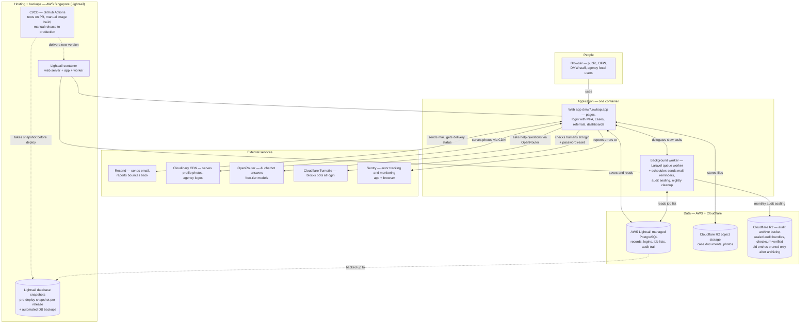

# System Architecture — High-Level with Services

> **Version:** 9.6.0 | **Updated:** 2026-10-02 | **Audience:** DICT + general reviewers
> **Note:** earlier drafts v1–v8 were removed; this file is the single current copy.
> **Scope:** Production. Single container on AWS Lightsail. No Redis.

## Diagram

## Services used

- **Lightsail containers (AWS Singapore)** — runs the whole app in one box: web server + application + background worker.
- **Lightsail managed PostgreSQL (AWS)** — the master record book: people, cases, referrals, logins, job lists, audit trail.
- **Cloudflare R2 object storage** — case documents and photos. Private, not public. (Config supports any S3-compatible endpoint; production uses R2 via `FILESYSTEM_DISK=r2`.)
- **Cloudflare R2 — audit archive bucket** — sealed, checksum-verified audit bundles; a monthly scheduled job archives expired entries first, and old entries are pruned only after archiving.
- **Resend** — sends login codes, notices, reminders; reports bounces and delivery status back via webhook.
- **Cloudinary CDN** — serves profile photos and agency logos from Cloudinary's CDN (`res.cloudinary.com`); uploads go through the app, browsers load images straight from the CDN.
- **OpenRouter** — AI chatbot answers via OpenRouter free-tier models (Laravel AI SDK, `AI_CHATBOT_PROVIDER=openrouter`, key from `OPENROUTER_API_KEY`).
- **Cloudflare Turnstile** — human-vs-robot check at login and password reset (verified against Cloudflare).
- **Sentry** — error tracking and monitoring for the app and the browser (backend SDK + browser SDK via `initSentry`, scrubbed before send) so the team sees failures fast, including scheduled-job failures.
- **CI/CD — GitHub Actions (high level)** — pull requests and merges to `main` run lint, audits, builds, and tests; release images are built manually into AWS ECR; production releases are manual (typed confirmation) promoting a tested image tag, with a pre-deploy database snapshot, migrations inside the container, and `/up` + `/api/readyz` health gates before traffic switches over.
- **Lightsail database snapshots** — pre-deploy snapshot on every release plus automated DB backups, both kept in Lightsail (same region).
