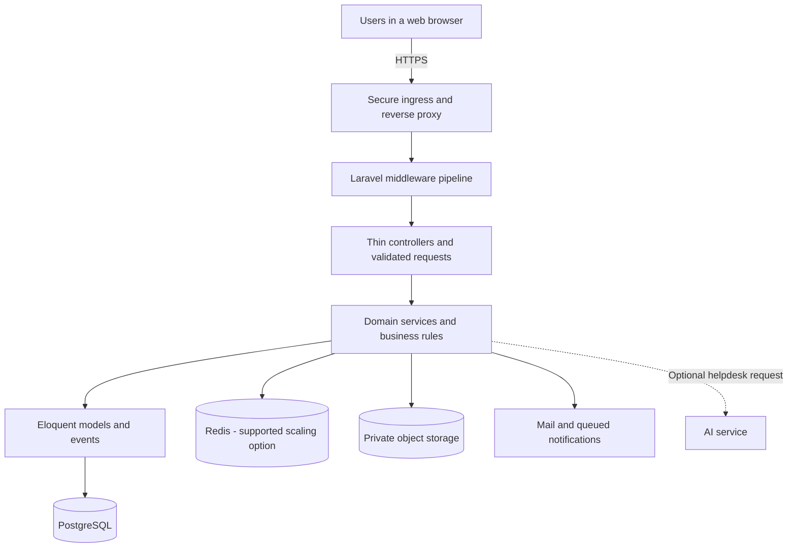
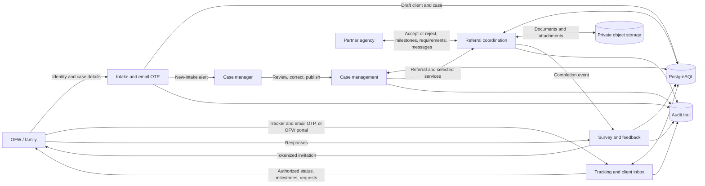
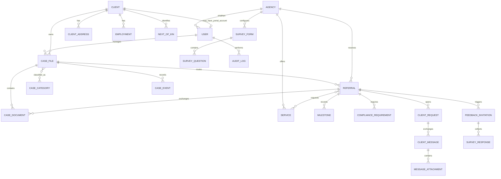
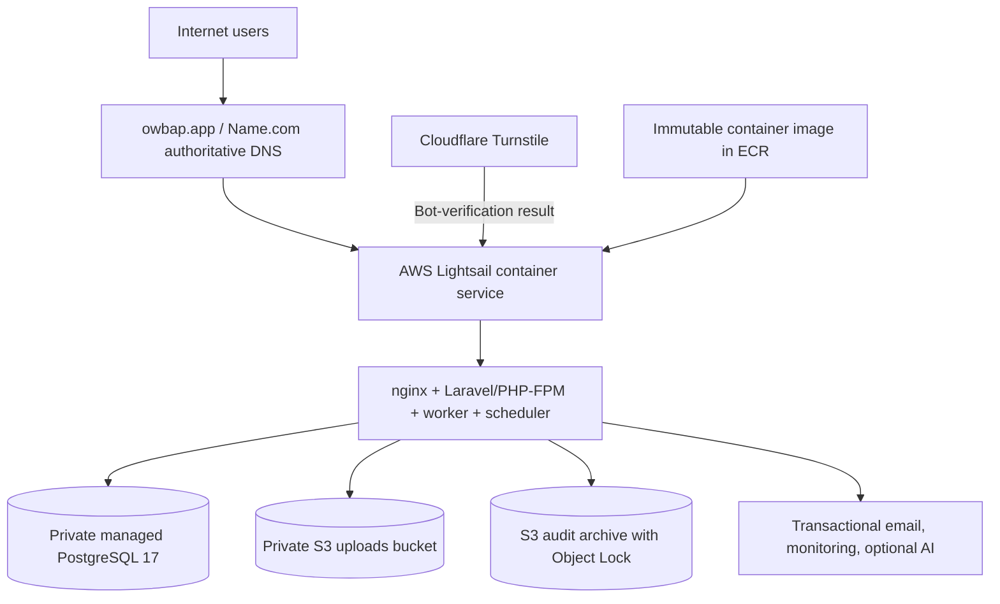

# Claude Design Prompt: One Window Bayanihan for DICT Region VII

Copy everything below the horizontal rule into Claude Design or another Claude environment capable of creating PowerPoint presentations.

---

Create a polished, technically accurate PowerPoint presentation for a meeting with the Department of Information and Communications Technology (DICT) Region VII. The subject is **One Window Bayanihan**, an inter-agency case-management system for overseas Filipino workers (OFWs) and their families.

## Required deliverable

- Create one editable `.pptx` presentation with exactly **13 main slides**.
- Use a free, open-source presentation library such as **PptxGenJS** and render diagrams with **Mermaid**. Do not use Canva.
- Use a 16:9 widescreen layout.
- Save the final file as:
  `docs/presentations/ONE_WINDOW_BAYANIHAN_DICT_REGION_VII_TECHNICAL_PRESENTATION_v1.0.0.pptx`
- Preserve the Mermaid source for all diagrams in the build source or accompanying notes.
- Add concise presenter notes to every slide.
- Add a `[Sources]` section to speaker notes whenever the slide includes external or non-trivial factual claims.
- Do not create, reproduce, or modify an evaluation form. The team already has one and the presenter will bring it.

## Meeting context

- **Meeting title:** Technical Evaluation and Data Sovereignty Consultation: One Window Bayanihan
- **Audience:** DICT Region VII technical experts, program stakeholders, infrastructure personnel, cybersecurity/privacy representatives, and decision-makers
- **Presenter:** Josephus Kim L. Sarsonas
- **Team:** Datababes
- **School:** Cebu Technological University - Main Campus
- **Date and time:** 1 September 2026, 3:00 PM, Asia/Manila
- **Presentation duration:** approximately 20 minutes, followed by 10 minutes of discussion

## Communication objective

By the end of the presentation, DICT Region VII should be prepared to:

1. Technically evaluate One Window Bayanihan as part of the team's capstone requirement using the team's existing ISO/IEC 25010:2023-aligned evaluation form.
2. Identify product-quality, architecture, security, privacy, accessibility, interoperability, deployment, and operational improvements.
3. Advise the team and the appropriate DMW representatives about Philippine data-sovereignty, privacy, legal, and government-cloud considerations.
4. Explore whether a DMW-sponsored pilot could use a DICT data center, Government Cloud, National Government Data Center, Government Web Hosting Service, or another Philippine-resident government hosting option.
5. Guide the team and DMW Region VII regarding an official DMW service subdomain, preferably under the existing `ro7.dmw.gov.ph` namespace, subject to authorization.
6. Identify the DICT, DMW, cybersecurity, privacy, infrastructure, and legal owners needed for formal next steps.

## Central message

One Window Bayanihan is a portable, layered case-management platform built around a shared case record, controlled inter-agency referrals, traceable service delivery, and defense-in-depth security. It currently operates as a production pilot in an AWS region in Singapore, but its containerized, provider-portable design provides a credible path toward DICT-hosted or Philippine-resident infrastructure.

## Visual direction

Follow these constraints strictly:

- Pure white background on every slide.
- Black or near-black text, lines, icons, and diagram elements only.
- No decorative colors, gradients, shadows, textures, stock photographs, or unsupplied logos.
- Use one clean sans-serif font family throughout, preferably Aptos, Arial, or Inter.
- Deck title must be at least 50 pt.
- Slide titles must be at least 35 pt.
- Subheadings and callout headers must be at least 24 pt.
- Body text must be at least 16 pt, preferably 18-22 pt.
- Use generous margins and strong alignment.
- Avoid dense dashboard-style card grids.
- Use one dominant composition per slide.
- Diagrams must use clean black strokes, white fills, readable labels, and consistent arrow styles.
- Do not place raw Mermaid code on the visible slide; render it as a diagram.
- Use subtle line weight, spacing, and typography to establish hierarchy without color.
- Number slides discreetly in the lower-right corner, except the title slide.

## Accuracy and claim guardrails

- Present ISO/IEC 25010:2023 as the primary **product-quality evaluation model**, not as a certification held by the project.
- Do not describe the project as following ISO/IEC 27001. Do not claim ISO certification.
- Security is one of the nine ISO/IEC 25010:2023 product-quality characteristics, but Philippine privacy and government-cloud obligations remain separate governance matters.
- Do not claim that foreign hosting is automatically illegal under Philippine law.
- Explain that the personal information controller remains accountable for safeguards when personal data is processed internationally.
- Do not give legal advice. Frame legal and policy statements as questions for DICT and the proper DMW/privacy/legal authorities.
- Do not disclose credentials, cloud account numbers, resource identifiers, private endpoints, internal IP addresses, allowlist values, secrets, or detailed vulnerability findings.
- Do not claim that every personal-data field is encrypted. Say that selected high-risk fields, messages, or snapshots use application-level encryption where implemented.
- Do not claim universal malware scanning. State that malware scanning is configurable and must be verified in the target environment.
- Staff login uses password authentication followed by policy-based TOTP or a recovery code when MFA applies.
- Public intake and tracking use email OTP or token-based flows and remain separate from staff authentication.
- The current production pilot uses PostgreSQL-backed sessions, cache, and queues. Redis 7 is supported as a scaling option but is not the current production runtime store.
- The pilot currently has one application node and no separate staging environment.
- Use a domain-level ER diagram. Do not claim an exact database-table count.
- These functions are modules in one Laravel application, not independently deployed microservices.

## Slide-by-slide specification

### Slide 1 - One Window Bayanihan

Visible content:

- One Window Bayanihan
- Inter-agency case management for OFWs and their families
- Technical Evaluation and Data Sovereignty Consultation
- Presented to DICT Region VII
- Josephus Kim L. Sarsonas
- Datababes | Cebu Technological University - Main Campus
- 1 September 2026 | 3:00 PM

Design:

- Minimal title slide.
- Large left-aligned title with a thin black rule.
- No diagram, screenshot, or long paragraph.

Presenter-note objective:

Introduce the system and explain that the session seeks expert product-quality evaluation, policy guidance, and a possible government-hosting path.

### Slide 2 - One shared case record reduces fragmented follow-through

Visible content:

- DMW case managers create and manage a unified OFW case.
- One case can be referred to multiple partner agencies.
- Each agency works only within its assigned referral lane.
- OFWs and their families can self-file, track progress, and respond through controlled flows.
- Milestones, documents, client requests, notifications, feedback, and audit events remain connected to the case.
- The shared master case file coordinates agencies; it does not replace their internal systems.

Visual:

Create a horizontal service journey:

`Intake -> Referral -> Agency action -> Client update -> Completion and feedback`

Presenter-note objective:

Explain the service-coordination problem before discussing technology.

### Slide 3 - Roles separate responsibility while preserving coordination

Create four clear actor lanes:

1. **Case Manager**
   - Client intake
   - Unified case management
   - Referrals and reports
   - Access to assigned or authorized case work

2. **Partner Agency**
   - Accept or reject referrals
   - Record milestones and progress
   - Request compliance
   - Complete assigned service work
   - Access only its agency referral lane

3. **Administrator**
   - Users and agencies
   - Reference data
   - Security and operations
   - Privileged routes with additional network restrictions

4. **OFW / Family**
   - Self-file a concern
   - Track a case
   - Answer requests
   - Submit feedback
   - Use OTP/token-controlled public access or a separate OFW portal; never a staff role

Presenter-note objective:

Establish the authorization model and trust boundaries.

### Slide 4 - The system can be evaluated through four representative journeys

Use four large, evenly spaced black-outline screenshot placeholders. Do not invent screenshots.

Label them:

1. **OFW intake and tracking** - self-file a concern and follow its status.
2. **Case-manager workspace** - review intake, manage the unified case, and issue referrals.
3. **Agency referral lane** - accept work, record milestones, request compliance, and complete service.
4. **Oversight and evidence** - reports, audit trail, security administration, and operational health.

Add a discreet footer:

`Optional live demonstration if meeting connectivity permits.`

Presenter-note objective:

Explain that verified, sanitized application captures can replace the placeholders later.

### Slide 5 - The application follows a layered, auditable design

Render this Mermaid diagram as a clean black-line architecture visual:



Visible supporting points:

- Inertia connects Laravel responses to the React interface.
- Controllers own the request boundary; services own business rules and audit logging.
- PostgreSQL is the system of record.
- Shared files and asynchronous work are externalized through object storage and queues.

Presenter-note objective:

Explain separation of concerns and where trust boundaries begin.

### Slide 6 - A case moves through controlled hand-offs, not disconnected systems

Render this Mermaid data-flow diagram. Simplify label placement if needed, but preserve the meaning:



Visible supporting points:

- Public tracking remains separate from staff authentication.
- Access is restricted by role, agency, and case relationship.
- Files remain private and use controlled download flows.
- These are modules within one Laravel application, not microservices.

Presenter-note objective:

Explain what information crosses each boundary and why.

### Slide 7 - The data model keeps the case at the center

Render this Mermaid ER diagram as a readable domain-level model. If the full diagram becomes too dense, visually emphasize the Client -> Case -> Referral core and place supporting domains around it without removing them.



Add compact callouts:

- UUID primary keys
- Referential integrity
- Selected high-risk fields encrypted where implemented
- Flag-based soft deletion for business records
- Append-only and integrity controls for audit records
- File metadata in PostgreSQL; payloads in private object storage

Presenter-note objective:

Show that the model preserves the chain from client to case, referral, agency work, and service outcome.

### Slide 8 - The technology stack favors maintainability and portability

Use a clean vertical stack or two-column table:

| Layer | Technology |
|---|---|
| User interface | React 18, Inertia.js 2, Tailwind CSS 3 |
| Application | Laravel 13 on PHP 8.4 |
| Data | PostgreSQL 17; Redis 7 supported for scaled deployments; current pilot uses PostgreSQL-backed sessions, cache, and queues |
| Files | S3-compatible private object storage |
| Delivery | OCI container, nginx, PHP-FPM, Supervisor |
| Build and quality | Vite 8, PHPUnit 12, Vitest 4, TypeScript checks, Pint, dependency audits |
| Supporting capabilities | Transactional email, PDF/Excel export, error monitoring, optional AI helpdesk |

Presenter-note objective:

Connect each technology choice to maintainability, interoperability, or portability rather than reading a package list.

### Slide 9 - The current production pilot runs on AWS Singapore

Render this Mermaid deployment diagram:



Visible facts:

- Public service: `https://dmw7.owbap.app`
- Domain and authoritative DNS: Name.com
- Current region: AWS `ap-southeast-1`, Singapore
- Cloudflare's confirmed role: Turnstile bot protection, not DNS or application hosting
- Current pilot: one application node; no separate staging environment
- Current sessions, cache, and queues: PostgreSQL-backed
- Delivery: immutable commit-tagged image, pre-deployment database snapshot, controlled migration/startup gates, health checks, and rollback to a previous image
- Portability: the same application image and data model can move to any target that supplies the required compute, database, storage, mail, secret, backup, and monitoring capabilities

Presenter-note objective:

Describe the foreign-region pilot honestly and establish why DICT-hosted or Philippine-resident infrastructure should be evaluated.

### Slide 10 - ISO/IEC 25010:2023 frames the product-quality evaluation

This is the primary evaluation-framework slide. Do not substitute ISO/IEC 27001.

Create a monochrome 3 x 3 matrix containing the nine ISO/IEC 25010:2023 product-quality characteristics:

1. Functional suitability
2. Performance efficiency
3. Compatibility
4. Interaction capability
5. Reliability
6. Security
7. Maintainability
8. Flexibility
9. Safety

Add a compact evidence mapping:

- **Functional suitability:** case, referral, tracking, feedback, and reporting workflows
- **Performance efficiency:** response-time, capacity, queue, and database checks
- **Compatibility:** standards-based web, database, object-storage, mail, and deployment interfaces
- **Interaction capability:** guided workflows, validation, accessibility, and user assistance
- **Reliability:** health checks, backup, recovery, scheduling, monitoring, and rollback
- **Security:** authentication, MFA, RBAC, agency isolation, RLS, private files, audit evidence, and secure headers
- **Maintainability:** layered modules, service boundaries, automated tests, type checks, and repeatable builds
- **Flexibility:** container portability, configurable infrastructure services, and provider-neutral deployment contract
- **Safety:** validation, controlled state transitions, failure containment, recovery, and protection against harmful outcomes

Visible disclaimer:

`ISO/IEC 25010:2023 is used as a product-quality evaluation model, not as a certification claim.`

Also state:

`Privacy law, data-governance requirements, and DICT cloud policy remain separate obligations.`

Presenter-note objective:

Explain how DICT experts can use the team's existing ISO/IEC 25010:2023-aligned form to evaluate the presented product and evidence.

### Slide 11 - Quality gates make releases repeatable and reviewable

Render this Mermaid CI/CD diagram:

```mermaid
flowchart LR
    CHANGE[Pull request or main-branch change] --> CI[Style, dependency, type, build, backend and frontend gates]
    CI --> BUILD[Intentional image build tagged with commit SHA]
    BUILD --> APPROVAL[Manual production confirmation and approval]
    APPROVAL --> SNAPSHOT[Pre-deploy database snapshot]
    SNAPSHOT --> ROLLOUT[Migration and startup gate with exact-image rollout]
    ROLLOUT --> HEALTH[Shallow /up and protected deep /api/readyz]
    HEALTH --> RECORD[Verification, release record and rollback readiness]
```



Visible supporting points:

- CI uses PostgreSQL 17 to match production query and migration behavior.
- Pull requests and main-branch changes trigger quality gates.
- Image building and production deployment are separate, intentional operations.
- Migrations follow expand-migrate-contract discipline.
- Operational evidence includes liveness, deep readiness, database connectivity, scheduler heartbeat, mail transport, queue health, object-storage access, TLS, errors, and backup status.
- This supports ISO/IEC 25010:2023 reliability, maintainability, security, and flexibility.

Presenter-note objective:

Show that deployment and rollback are product-quality controls, not merely hosting tasks.

### Slide 12 - Data location is a governance decision, not only a hosting setting

Use a balanced two-column composition.

Left column: **What we know**

- The current application, production data, uploads, and backups use AWS services in Singapore.
- Philippine privacy law does not automatically prohibit international processing, but the personal information controller remains accountable for comparable protection and appropriate safeguards.
- Government-cloud decisions depend on data classification, agency authority, the DICT Cloud First Policy, supplier terms, security, continuity, and current government data-residency guidance.
- DICT's current interpretation should be confirmed directly rather than inferred by the student team.

Right column: **Questions for DICT and the appropriate DMW/privacy/legal authorities**

1. How should OFW case records, identity information, vulnerability details, and uploaded documents be classified?
2. Is an overseas cloud region acceptable for this workload, and what contractual, encryption, key-control, audit, and incident-notification safeguards are required?
3. Can a DMW-sponsored capstone pilot qualify for DICT Government Web Hosting, the National Government Data Center, Government Cloud, or another Philippine-resident service?
4. Can DMW authorize a service subdomain such as `bayanihan.ro7.dmw.gov.ph`, and who should own DNS, certificates, and operations?
5. Which privacy impact assessment, privacy notice, legal-basis analysis, outsourcing or data-sharing agreement, retention schedule, and breach-response documents are required before real use?
6. What technical evaluation, vulnerability assessment, onboarding, migration, and service-acceptance process would DICT require?

Presenter-note objective:

Ask precise questions without giving legal advice or implying that foreign hosting is automatically unlawful.

### Slide 13 - We are asking DICT to evaluate, guide, and explore a hosting path

Visible requests:

- Provide a technical capstone evaluation using the team's existing ISO/IEC 25010:2023-aligned evaluation form.
- Identify product-quality, architecture, security, privacy, accessibility, interoperability, and operational improvements.
- Explore the feasibility and onboarding path for a DICT-hosted or Philippine-resident DMW-sponsored pilot.
- Guide DMW on an official service subdomain under its existing government namespace.
- Identify the DICT, DMW, cybersecurity, privacy, infrastructure, and legal owners required for formal next steps.
- If feasible, define a controlled pilot, migration test, security review, backup/recovery exercise, and acceptance process.

Use this as the large closing question:

**Can DICT Region VII help evaluate the system and identify a path toward government-hosted deployment under an official DMW domain?**

Do not create a generic “Thank you” slide after this. End on the partnership request.

## Presenter notes and transitions

Add brief notes to every slide containing:

- A 30-90 second talk track, depending on slide density.
- One explicit transition to the next slide.
- A reminder on Slide 4 that the live demo is optional and the deck must stand alone.
- A reminder on Slide 10 that ISO/IEC 25010:2023 is an evaluation lens, not certification.
- A reminder on Slide 12 to request authoritative guidance rather than making a legal conclusion.
- A reminder on Slide 13 that the existing evaluation form is brought separately by the presenter.

## Source material to verify

Use the current repository and prefer the highest-version document when duplicates exist:

- `docs/PROJECT_RULES_v2.1.0.md`
- `docs/ARCHITECTURE_v2.1.0.md`
- `docs/DATA_MODEL.md`
- `docs/SECURITY_REQUIREMENTS_v2.1.0.md`
- `docs/DEPLOYMENT_GUIDE_v3.0.0.md`
- `docs/DEPLOYMENT_PRODUCTION_AWS_v1.6.0.md`
- `docs/DEPLOYMENT_COSTING_v1.0.0.md`
- `docs/CI_CD_GUIDE_v2.0.0.md`
- `docs/compliance/system-and-service-profile-v1.0.0.md`
- `docs/compliance/external-evidence-required-v1.0.0.md`
- `docs/management/bcp-dr-plan.md`
- `.github/workflows/`
- `composer.json`
- `package.json`
- `.env.example`
- `Dockerfile`
- `docker-compose.yml`
- Current migrations, routes, middleware, services, and models

External authoritative sources for speaker-note citations:

- ISO/IEC 25010:2023 official page: `https://www.iso.org/standard/78176.html`
- Philippine Data Privacy Act: `https://privacy.gov.ph/data-privacy-act/`
- NPC Advisory No. 2024-01 on contractual clauses for cross-border transfers: `https://privacy.gov.ph/wp-content/uploads/2024/06/Published-NPC-Advisory-No.-2024-01-Contractual-Clauses-for-Cross-Border-Transfers_30May24.pdf`
- DICT Cloud First Policy: `https://cms-cdn.e.gov.ph/DICT/pdf/Signed_DICT-Circular_2017-002_CloudComp_2017Feb07.pdf`
- DICT 2025 Citizen's Charter: `https://cms-cdn.e.gov.ph/DICT/pdf/DICT-Citizens-Charter-2025-1st-Edition.pdf`
- DICT `.gov.ph` registration instructions: `https://cms-cdn.e.gov.ph/DICT/pdf/GOV.PH-Registration_R001.pdf`
- DICT data-residency consultation: `https://dict-dev.e.gov.ph/Data-Residency`
- DMW Region VII official site: `https://ro7.dmw.gov.ph/`

Use a notes block in this form:

```text
[Sources]
- Repository: docs/ARCHITECTURE_v2.1.0.md
- Repository: docs/DEPLOYMENT_PRODUCTION_AWS_v1.6.0.md
- https://www.iso.org/standard/78176.html
[/Sources]
```

## Quality assurance before delivery

Before returning the `.pptx`:

1. Render every slide to an image.
2. Inspect every slide at full size and as a montage.
3. Fix all unintended overlaps, clipping, overflow, unreadably small text, disconnected arrows, and inconsistent alignment.
4. Verify that the deck contains exactly 13 main slides.
5. Verify that the background is white and audience-facing text is black or near-black throughout.
6. Verify that the Mermaid diagrams are legible when projected.
7. Verify that screenshot frames remain placeholders rather than fabricated application screens.
8. Verify that Slide 10 says ISO/IEC 25010:2023 and contains all nine current product-quality characteristics.
9. Verify that no slide claims ISO certification or ISO/IEC 27001 alignment.
10. Verify that Slide 11 clearly explains CI/CD.
11. Verify that the existing evaluation form is referenced but not recreated.
12. Verify that the final slide ends with the DICT partnership request.
13. Confirm that the `.pptx` opens successfully in Microsoft PowerPoint and that all visible elements stay within the slide bounds.

Return only the final presentation, its editable build source, and a short QA summary.
