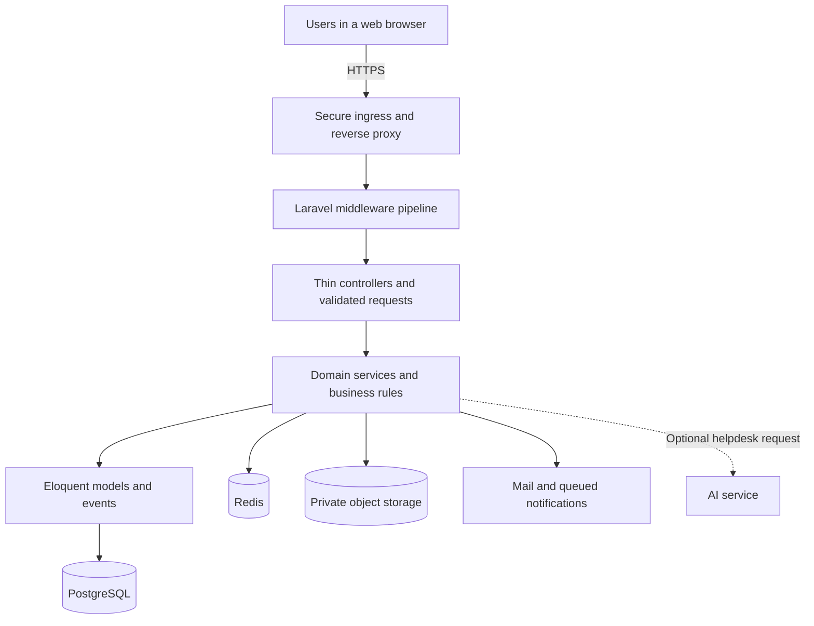
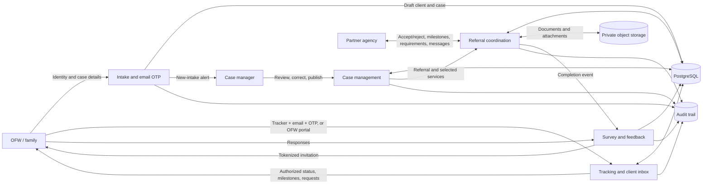
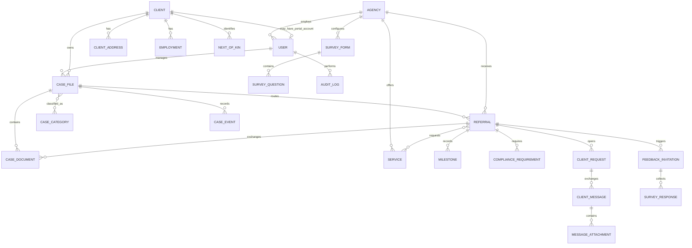
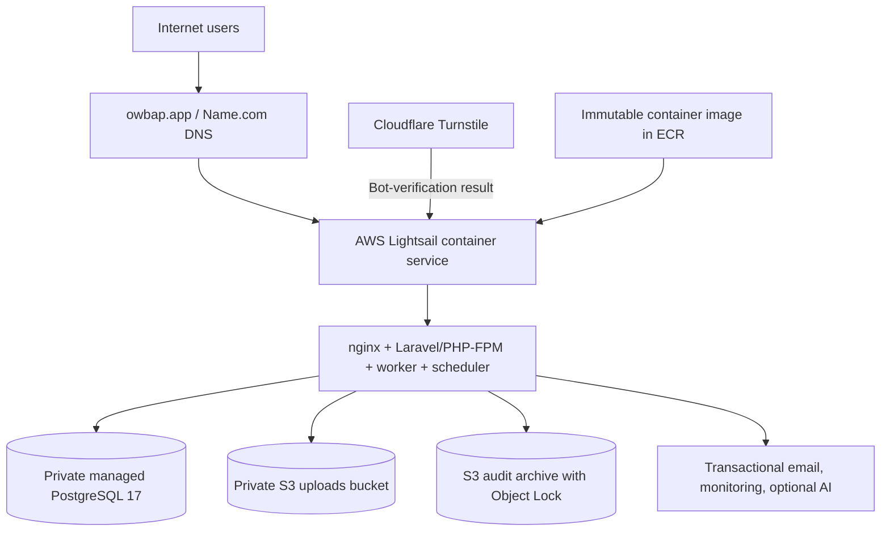
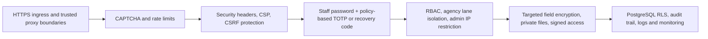

```mermaid
flowchart LR
    CHANGE[Pull request or main-branch change] --> CI[Style, dependency, type, build, backend and frontend gates]
    CI --> BUILD[Intentional image build tagged with commit SHA]
    BUILD --> APPROVAL[Manual production confirmation and approval]
    APPROVAL --> SNAPSHOT[Pre-deploy database snapshot]
    SNAPSHOT --> ROLLOUT[Migration/startup gate and exact-image rollout]
    ROLLOUT --> HEALTH[Shallow /up and protected deep readiness]
    HEALTH --> RECORD[Verification, release record and rollback readiness]
```

# One Window Bayanihan — DICT Region VII Presentation Plan

| Field | Draft value |
|---|---|
| Status | Approved for slideshow production |
| Prepared | 2026-09-01 |
| Audience | Mixed DICT Region VII technical experts, program stakeholders, and decision-makers |
| Purpose | Capstone technical evaluation, data-sovereignty/legal guidance, and exploration of DICT hosting and government-domain support |
| Proposed length | 13 slides; approximately 20 minutes plus 10 minutes for discussion |
| Visual direction | White background, black text, restrained line diagrams, no decorative color |
| Presentation mode | Architecture briefing with screenshot-led demonstration, standards mapping, and a concrete partnership request |
| Team | Datababes |
| School | Cebu Technological University — Main Campus |
| Presenter | Josephus Kim L. Sarsonas |
| Meeting title | Technical Evaluation and Data Sovereignty Consultation: One Window Bayanihan |
| Meeting schedule | 1 September 2026, 3:00 PM (Asia/Manila) |

## Communication job

By the end, DICT Region VII should be prepared to technically evaluate One Window Bayanihan for the capstone, advise on Philippine data-sovereignty and legal requirements, and explore whether DICT infrastructure and a government-domain arrangement can support a future deployment.

## Central message

One Window Bayanihan is a portable, layered case-management platform built around a shared case record, controlled inter-agency referrals, traceable service delivery, and defense-in-depth security. It currently runs on an overseas commercial-cloud region, but its containerized and provider-portable design creates a credible path toward DICT-hosted or Philippine-resident infrastructure.

## Scope boundaries

- Present the design and current implementation, not a claim of certification or formal DICT approval.
- Explain the current AWS, Name.com, and Cloudflare arrangement, then separate it from the provider-neutral target architecture.
- Do not display cloud account numbers, resource identifiers, private endpoints, credentials, or detailed vulnerability findings.
- Show the database as a domain-level model rather than an unreadable inventory of every framework and support table.
- Show representative data flows. Do not expose credentials, real client records, internal endpoints, IP allowlists, or other sensitive configuration.
- Identify operational prerequisites and evidence gaps without overstating unverified production controls.
- Describe ISO and legal frameworks as alignment targets and review lenses, not certification or legal conclusions.

## Proposed narrative

The story moves from the public-service problem to the user experience, then opens the system layer by layer: application design, data flow, database, technology, current hosting, security and standards, delivery operations, data-sovereignty choices, and the partnership requested from DICT.

## Slide-by-slide storyboard

### Slide 1 — One Window Bayanihan connects one case to coordinated action

**Audience-facing content**

- One Window Bayanihan
- Inter-agency case management for OFWs and their families
- Technical Evaluation and Data Sovereignty Consultation
- Presented to DICT Region VII
- Josephus Kim L. Sarsonas · Datababes · Cebu Technological University — Main Campus
- 1 September 2026 · 3:00 PM

**Narrative job**

Establish the system, public-service context, and purpose of the briefing. Keep the title slide minimal.

---

### Slide 2 — One shared case record reduces fragmented follow-through

**Audience-facing content**

- DMW case managers create and manage an OFW case.
- One case can be referred to multiple partner agencies.
- Each agency works only within its assigned referral lane.
- OFWs can self-file, track progress, and respond through controlled public or OFW-portal flows.
- Milestones, documents, feedback, notifications, and audit events remain connected to the case.
- The shared master case file coordinates agencies; it does not replace each agency's internal system.

**Narrative job**

Explain the problem the architecture solves before introducing technology.

**Suggested visual**

A simple horizontal service journey: intake → referral → agency action → client update → completion and feedback.

---

### Slide 3 — Roles separate responsibility while preserving coordination

**Audience-facing content**

| Actor | Main responsibility | Access boundary |
|---|---|---|
| Case Manager | Client intake, case management, referrals, reports | Assigned/authorized case work |
| Partner Agency | Accept or reject referrals, update progress, request compliance | Its own agency referral lane |
| Administrator | Users, agencies, reference data, security and operations | Privileged routes plus additional network restriction |
| OFW / Family | Self-file, track a case, answer requests, submit feedback | OTP/token-controlled public access or a separate OFW portal; never a staff role |

**Narrative job**

Make the authorization model understandable before showing the system architecture.

---

### Slide 4 — The system can be evaluated through four representative journeys

**Audience-facing content**

Four black-outline screenshot placeholders, to be replaced with verified application captures during slideshow production:

1. **OFW intake and tracking** — self-file a concern and follow its status.
2. **Case-manager workspace** — review intake, manage the unified case, and issue referrals.
3. **Agency referral lane** — accept work, record milestones, request compliance, and complete service.
4. **Oversight and evidence** — reports, audit trail, security administration, and operational health.

**Demonstration cue**

Use the screenshots as a guided walkthrough. If connectivity and meeting conditions allow, transition to a short live demonstration after this slide; the deck must still stand on its own if the live system is unavailable.

**Narrative job**

Make the architecture concrete by showing the user-facing workflows that the later technical slides explain.

---

### Slide 5 — The application follows a layered, auditable design

**Audience-facing content**

**Key points**

- Inertia connects Laravel server responses to the React interface.
- Controllers handle the request boundary; services own business rules and audit logging.
- PostgreSQL is the system of record; Redis and object storage externalize shared runtime state and files.
- Events and queues handle notifications and other asynchronous work.

**Narrative job**

Show how concerns are separated and where trust boundaries begin.

---

### Slide 6 — A case moves through controlled hand-offs, not disconnected systems

**Audience-facing content**

**Key points**

- Public tracking is separated from staff authentication.
- Referral access is restricted by role, agency, and case relationship.
- Case documents and referral attachments remain private and are delivered through controlled download flows.
- Business activity produces audit context for accountability.
- These are modules inside one Laravel application, not independently deployed microservices.

**Narrative job**

Explain what information crosses each boundary and why.

---

### Slide 7 — The data model keeps the case at the center

**Audience-facing content**

**Design points**

- UUID primary keys reduce predictable identifier exposure and support distributed creation.
- Referential constraints preserve the chain from client to case to referral and service outcome.
- Sensitive fields use application-level encrypted casts where implemented.
- Business records use flag-based soft deletion; audit records use append-only and integrity controls.
- Object metadata is stored in PostgreSQL while file payloads live in private object storage.

**Narrative job**

Present the relational model at a readable domain level. A detailed schema can be an appendix if requested.

---

### Slide 8 — The technology stack favors maintainability and portability

**Audience-facing content**

| Layer | Technology |
|---|---|
| User interface | React 18, Inertia.js 2, Tailwind CSS 3 |
| Application | Laravel 13 on PHP 8.4 |
| Data | PostgreSQL 17; Redis 7 is supported for scaled deployments, while the current pilot uses PostgreSQL-backed sessions, cache, and queues |
| Files | S3-compatible private object storage |
| Delivery | OCI container, nginx, PHP-FPM, Supervisor |
| Build and quality | Vite 8, PHPUnit 12, Vitest 4, TypeScript checks, Pint, dependency audits |
| Supporting capabilities | Transactional email, PDF/Excel export, error tracking, optional AI helpdesk |

**Narrative job**

Connect each technology choice to a capability rather than presenting a package inventory.

---

### Slide 9 — The current production pilot runs on AWS Singapore

**Audience-facing content**

**Key points**

- Public service: `https://dmw7.owbap.app`; Name.com currently provides the domain and authoritative DNS path.
- AWS region: `ap-southeast-1` in Singapore; application, private PostgreSQL 17, container images, uploads, and audit archives use AWS services.
- Cloudflare's current confirmed role is Turnstile bot protection; it is not the hosting platform or authoritative DNS layer.
- The pilot is currently a single application node with PostgreSQL-backed sessions, cache, and queues; there is no separate staging environment.
- Releases use an immutable commit-tagged container image, a pre-deploy database snapshot, controlled migration/startup gates, shallow and deep readiness checks, and rollback to a previous image.
- The same application image and data model can move to another target that supplies the required compute, database, storage, mail, secret, backup, and monitoring capabilities.

**Narrative job**

Describe the current foreign-region pilot honestly and establish why a DICT-hosted or Philippine-resident option is worth evaluating.

---

### Slide 10 — Product quality and security are designed as one assurance system

**Audience-facing content**

**Key points**

- Staff authorization uses `CASE_MANAGER`, `AGENCY`, and `ADMIN` roles; OFW access remains a distinct boundary.
- Agency access is constrained to its assigned referral lane; database row-level security adds a second boundary.
- Public intake and tracking use throttled email-OTP or token flows rather than staff authentication.
- Uploads are checked by MIME type, extension and size; malware scanning is configurable and must be verified in the target environment; stored files remain private.
- Audit events include actor and request context, with database-level protections and archive/verification processes.

**Primary product-quality framework—not a certification claim**

- ISO/IEC 25010:2023 SQuaRE defines a product-quality model for specifying, measuring, and evaluating ICT and software products.
- The evaluation will use its nine product-quality characteristics: functional suitability, performance efficiency, compatibility, interaction capability, reliability, security, maintainability, flexibility, and safety.
- The architecture, workflows, tests, deployment controls, and security evidence shown in this briefing give DICT concrete material to assess against those characteristics.
- Republic Act No. 10173, NPC issuances, and the DICT Cloud First Policy remain separate legal and government-cloud considerations; they are not replaced by the product-quality model.

**Narrative job**

Explain defense in depth while avoiding the claim that technical controls alone establish compliance.

---

### Slide 11 — Quality gates make releases repeatable and reviewable

**Audience-facing content**

**Key points**

- CI uses PostgreSQL 17 to match production query and migration behavior.
- CI runs on pull requests and main-branch pushes; image building and production deployment are intentional, separately guarded operations.
- Database migrations follow an expand–migrate–contract discipline and require a verified backup before destructive work.
- Operational signals include shallow liveness, protected deep readiness, database connectivity, scheduler heartbeat, mail transport, queue health, object-storage access, TLS, errors, and backup status.

**Narrative job**

Show that deployment is an operational control, not merely a container build.

---

### Slide 12 — Data location is a governance decision, not only a hosting setting

**Audience-facing content**

**What we know**

- The current AWS region is Singapore, so production data and backups are not presently hosted in the Philippines.
- The Data Privacy Act does not automatically prohibit international processing, but the personal information controller remains accountable and must ensure comparable protection through contracts and safeguards.
- Government-cloud decisions also depend on data classification, the DICT Cloud First Policy, agency authority, supplier terms, continuity, and current DICT data-residency guidance.
- A 2025 DICT consultation proposed specific data-residency guidance for government agencies; DICT's current interpretation should be confirmed directly rather than inferred by the project team.

**Questions for DICT and the appropriate privacy/legal officers**

1. How should OFW case records, vulnerability details, identity data, and uploaded documents be classified?
2. Is processing in an overseas region acceptable for this workload, and what contractual, encryption, key-control, audit, and incident-notification safeguards are required?
3. Can this capstone or a DMW-sponsored pilot qualify for DICT Government Web Hosting, National Government Data Center, Government Cloud, or another Philippine-resident service?
4. Can DMW authorize a service subdomain under its existing government namespace—such as `bayanihan.ro7.dmw.gov.ph`—and who should own DNS, certificates, and operating responsibility?
5. Which PIA, privacy notice, consent/legal-basis analysis, data-sharing or outsourcing agreement, retention schedule, and breach-response documents must exist before real use?
6. What evaluation, vulnerability assessment, onboarding, migration, and service-acceptance process would DICT require?

**Narrative job**

Turn data sovereignty into a precise expert consultation. This slide asks legal and policy questions; it does not give legal advice or claim that foreign hosting is unlawful.

---

### Slide 13 — We are asking DICT to evaluate, guide, and explore a hosting path

**Audience-facing content**

- Provide a technical evaluation of the system as part of the capstone requirement.
- Review and sign the team's existing ISO/IEC 25010:2023-aligned technical evaluation form, clearly scoped as expert product-quality feedback rather than certification.
- Identify architecture, security, privacy, accessibility, interoperability, and operational improvements.
- Explore a DICT-hosted or Philippine-resident pilot using the same portable application image and data model.
- Guide DMW on a service subdomain under its existing government namespace and its ownership process.
- Identify the DICT, DMW, cybersecurity, privacy, and legal owners needed for a formal next step.
- If feasible, agree on a controlled pilot, migration test, security review, and recovery exercise.

**Closing question**

Can DICT Region VII help evaluate the system and identify a path toward government-hosted deployment under an official DMW domain?

**Narrative job**

End with a concrete review outcome rather than a generic thank-you slide.

## Optional appendix slides

Only add these if the allotted time or audience requires them:

1. Detailed case and referral state transitions.
2. Expanded database schema by domain.
3. Authentication sequences: staff password → TOTP/recovery code; public intake/tracking → email OTP or token.
4. Platform capability checklist with degraded modes.
5. Backup, recovery, monitoring, and incident-response responsibilities.
6. Route and module inventory.
7. Current AWS-to-DICT migration map and data-exit checklist.

## Proposed slideshow rules

- 16:9 widescreen.
- Pure white background; black or near-black text and lines.
- One sans-serif font family; no gradients, shadows, photos, logos, or decorative illustrations unless supplied later.
- Minimum 50 pt deck title, 35 pt slide titles, 24 pt subheads, and 16 pt body text.
- Use one main composition per slide, generous margins, and no dashboard-style card grids.
- Render Mermaid diagrams as clean black-line visuals; preserve the Mermaid source in this document.
- Put technical source references in speaker notes, not in the audience-facing canvas.
- Add presenter notes with a short talk track and explicit transitions after the storyline is approved.

## Decision record

Settled in review round 1:

1. The meeting is a capstone technical evaluation and consultation, with possible future DICT infrastructure and government-domain support.
2. The deck serves a mixed technical and decision-making audience; deep detail moves to the appendix.
3. Plan for approximately 20 minutes plus 10 minutes of discussion, with screenshot-led demonstration and an optional short live walkthrough.
4. Discuss the current AWS Singapore deployment, Name.com domain/DNS path, and Cloudflare Turnstile role explicitly.
5. Lead with implemented strengths and standards alignment; discuss operational gaps briefly and constructively without exposing detailed findings.
6. End by asking DICT to evaluate the capstone, advise on data sovereignty and legal requirements, explore a hosting path, and guide government-domain access.

Settled in review round 2:

1. Present the team's existing ISO/IEC 25010:2023-aligned technical evaluation form for DICT's review and signature.
2. Ask first for a feasibility assessment and onboarding path for a DMW-sponsored pilot, not immediate infrastructure allocation.
3. Present DMW Region VII as the intended government sponsor/owner, subject to management approval.
4. Ask DICT technical representatives for policy guidance and referral to the appropriate DPO, cybersecurity, NPC, or legal authority for formal advice.
5. Use the meeting title “Technical Evaluation and Data Sovereignty Consultation: One Window Bayanihan.”
6. Identify the team as Datababes, Cebu Technological University — Main Campus, presented by Josephus Kim L. Sarsonas on 1 September 2026 at 3:00 PM.
7. Prefer a DMW-controlled service subdomain under the existing `dmw.gov.ph` namespace over a separate new government domain, subject to DMW and DICT approval.
8. Use labelled screenshot placeholders in the first slideshow; real captures may replace them later after sanitization and approval.

Final production assumption:

1. The deck will mention the team's existing evaluation form but will not reproduce, create, or modify it.
2. Capstone degree/program and faculty-adviser attribution are omitted unless supplied later.

## Source basis

This plan is grounded in the current repository and the highest-version project documents available on 2026-09-01:

- [Project rules](../PROJECT_RULES_v2.1.0.md)
- [Architecture](../ARCHITECTURE_v2.1.0.md)
- [Data model](../DATA_MODEL.md)
- [Security requirements](../SECURITY_REQUIREMENTS_v2.1.0.md)
- [Deployment guide](../DEPLOYMENT_GUIDE_v3.0.0.md)
- [Current AWS production runbook](../DEPLOYMENT_PRODUCTION_AWS_v1.6.0.md)
- [Current deployment costing and service inventory](../DEPLOYMENT_COSTING_v1.0.0.md)
- [CI/CD guide](../CI_CD_GUIDE_v2.0.0.md)
- [System and service profile](../compliance/system-and-service-profile-v1.0.0.md)
- [External evidence register](../compliance/external-evidence-required-v1.0.0.md)
- [Business continuity and disaster-recovery plan](../management/bcp-dr-plan.md)
- `composer.json`, `package.json`, `.env.example`, `Dockerfile`, `docker-compose.yml`, migrations, routes, middleware, services, and models

External policy sources to cite in slide notes:

- [ISO/IEC 25010:2023 — SQuaRE product quality model](https://www.iso.org/standard/78176.html)
- [Republic Act No. 10173 — Data Privacy Act of 2012](https://privacy.gov.ph/data-privacy-act/)
- [NPC Advisory No. 2024-01 — Model Contractual Clauses for Cross-Border Transfers](https://privacy.gov.ph/wp-content/uploads/2024/06/Published-NPC-Advisory-No.-2024-01-Contractual-Clauses-for-Cross-Border-Transfers_30May24.pdf)
- [DICT Department Circular No. 2017-002 — Philippine Government Cloud First Policy](https://cms-cdn.e.gov.ph/DICT/pdf/Signed_DICT-Circular_2017-002_CloudComp_2017Feb07.pdf)
- [DICT 2025 Citizen's Charter — Government Web Hosting and `.gov.ph` services](https://cms-cdn.e.gov.ph/DICT/pdf/DICT-Citizens-Charter-2025-1st-Edition.pdf)
- [DICT `.gov.ph` domain application instructions](https://cms-cdn.e.gov.ph/DICT/pdf/GOV.PH-Registration_R001.pdf)
- [DICT consultation on draft government data-residency guidelines](https://dict-dev.e.gov.ph/Data-Residency)
- [DMW Region VII's existing government-domain site](https://ro7.dmw.gov.ph/)

Some descriptive documents lag recent migrations or remediations. Before the final slideshow is generated, every visible claim will be reconciled against current source/configuration, and any environment-specific claim will be labelled as either confirmed, proposed, or still requiring evidence.
